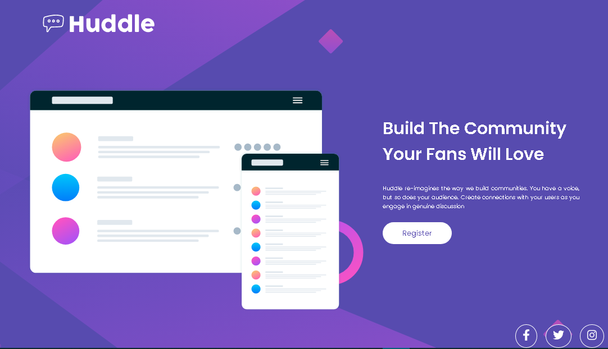
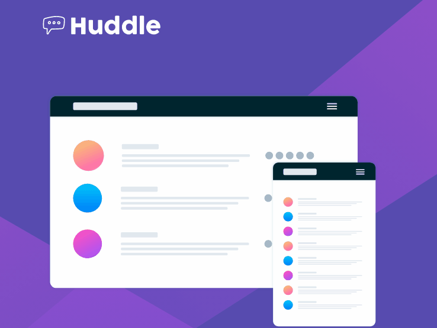
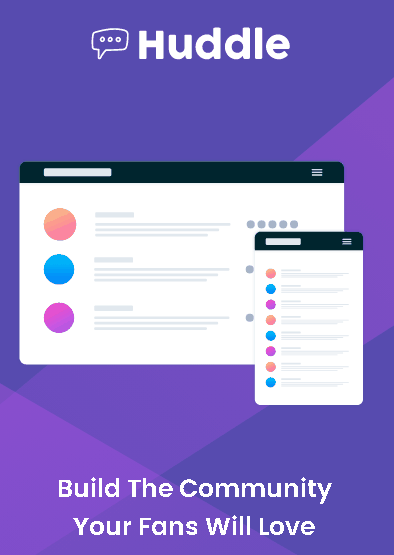

# Desafio CSS avançado - Landing Page Huddle 

 

## Desafios do projeto 😰

---

 

Começar e terminar um projeto do 0, foi uma experiência desafiadora, não ter ninguém para te auxiliar, procurar suas respostas internet a fora para resolver problemas que surgem, tudo foi parte de um aprendizado, e que vai servir para projetos futuros

 

Sem dúvida a parte do responsivo foi o que mais me deu dor de cabeça, de inicio,tinha feito o CSS com base no flex, mas depois de um tempo percebi que com o grid talvez fosse menos complicado. E realmente foi 😅

 

## Tecnologias Usadas 🛠

---

 

-   ## HTML 📝

-   ## CSS 🎨
 

## Responsivo na prática 💻📱

---

 

### Versão Full Scream

---

 
 

 
 

### Versão Tablet 768px

---

 
 

 
 

### Versão Mobile 425px

---

 
 

 
 
